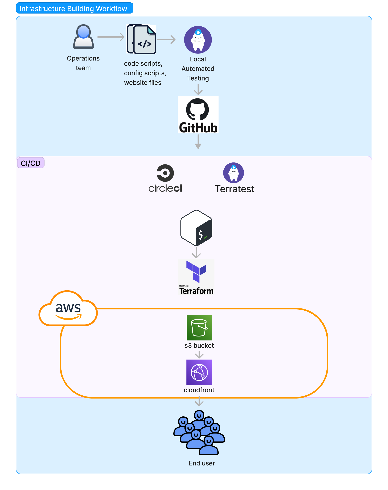

# Are you bored and don't know what to do? Well, Create and Visit the boring website!
 Click on the `I don't know what to do` and get a suggestion of acitivities you can try.

A static website on AWS s3, provisioned by Terraform, Shell scripts and Tested by Go.
-----------

&nbsp;
&nbsp;
&nbsp;
&nbsp;
&nbsp;

----------

### project workflow/diagram

Made with love by Ashraf Minhaj using **Terraform**, Hosted on **AWS s3**, Distributed using **Cloudfront**.

### Demo Screen Shot

------

#### Improvement/things can be added
* route53 with custom domain name and SSL

### Find me 
* linkedin [ashraf-minaj](https://www.linkedin.com/in/ashraf-minhaj)

This uses [Bored Api](https://www.boredapi.com) to suggest activities.
